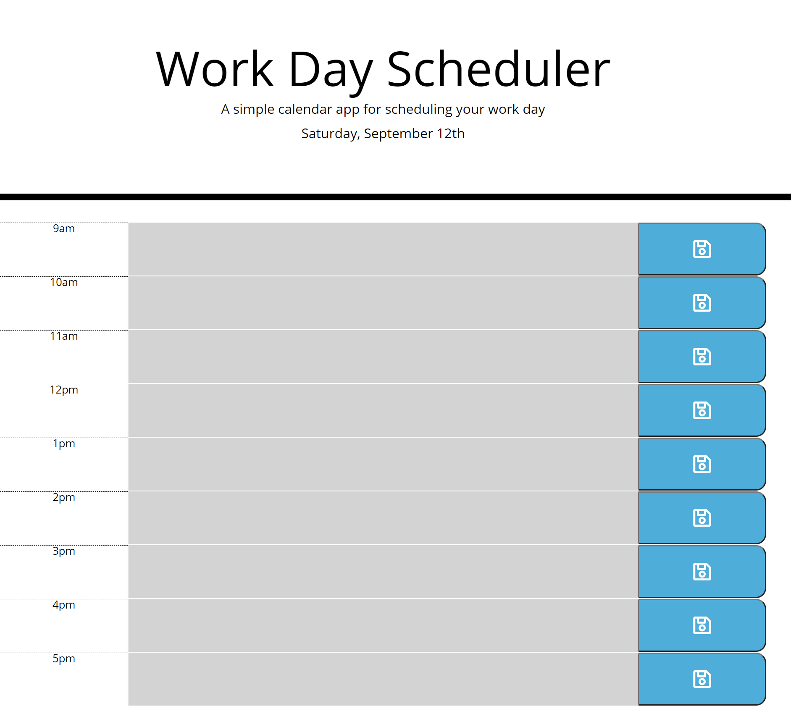

# Work-Day-Scheduler

## Description

The work-day-scheduler provides users a dynamic day planner to schedule events between 9am to 5pm. Time-blocks change colors based on present, past, and future events. Additionally, users saved events persist using client side local storage.

## Tools Used

- HTML
- CSS
- JavaScript
- Bootstrap
- jQuery
- Moment.JS

Below are links to the webpage and the github repository for my Work-Day-Scheduler application:

Github Pages URL: <https://rajdeep24.github.io/Work-Day-Scheduler/>

Github Repository: <https://github.com/rajdeep24/Work-Day-Scheduler>

## Table of Contents

- [Installation](#installation)
- [Usage](#usage)
- [Credits](#credits)
- [License](#license)

## Installation

No installation required. Simply view the application by clicking on the following link:

<>

## Usage

Below are is a screen shot of the Work-Day-Scheduler.

### Screenshots

## Credits

I would like to credit georgia tech's coding bootcamp and my tutor, Kevin Ferguson for helping me reinforce core concepts related to DOM manipulation and local storage.

TBD

## License

TBD

---

## Badges

